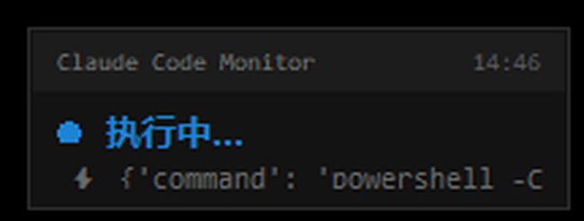

# Claude Code Monitor

一个轻量级的 **Claude Code 状态浮动监控窗口** — 在屏幕右上角显示一个小型悬浮窗，实时展示 Claude Code CLI 的当前状态（就绪 / 思考中 / 工作中 / 等待确认）。

A lightweight **floating status monitor** for Claude Code CLI — a small always-on-top window in the top-right corner of your screen showing what Claude is doing in real time.



---

## 功能特性

- 🟢 **实时状态指示** — 绿色空闲、橙色思考、蓝色工作中、红色等待 / 出错、灰色离线
- 💓 **脉冲动画** — `thinking` / `working` / `waiting` 状态下圆点呼吸动画
- 🔧 **工具图标** — 当前执行的工具类型以 emoji 显示（📖 读取、✏️ 写入、⚡ 命令、🔍 搜索…）
- 📌 **置顶悬浮** — 始终位于所有窗口之上，可拖拽移动，右键退出
- 🖥️ **跨平台** — Windows / macOS / Linux 均可运行（Windows 提供静默启动脚本）

---

## 工作原理

```
┌──────────────────────────────────────────────────┐
│              Claude Code CLI                       │
│  (通过 hooks 发送 curl POST 更新状态)                │
│       │                                            │
│       ▼                                            │
├──────────────────────────────────────────────────┤
│         HTTP 钩子服务器 (hook server)               │
│    127.0.0.1:17322 (status_server.py 独立版)       │
│    127.0.0.1:17323 (status_monitor.py 内嵌版)      │
│       │                                            │
│       │  写入 ~/.claude/status.json                 │
│       ▼                                            │
├──────────────────────────────────────────────────┤
│       Tkinter GUI 监控窗口 (status_monitor.py)       │
│    每 400ms 轮询 status.json 并更新界面              │
│    右上角 200×68 半透明置顶悬浮窗                    │
└──────────────────────────────────────────────────┘
```

---

## 安装

### 前提条件

- **Python 3.8+**（建议 3.10+）
- **Tkinter**（Python 标准库自带，部分 Linux 需要单独安装）

Linux 用户可能需要：
```bash
# Debian / Ubuntu
sudo apt install python3-tk

# Fedora
sudo dnf install python3-tkinter

# Arch
sudo pacman -S tk
```

macOS / Windows 用户无需额外安装。

### 下载

```bash
git clone https://github.com/your-username/claude-code-monitor.git
cd claude-code-monitor
```

无外部依赖，仅使用 Python 标准库。

---

## 使用方法

### 方式一：一体化监控（推荐）

直接运行 `status_monitor.py`，GUI 窗口 + 内嵌钩子服务器（端口 17323）同时启动：

```bash
python status_monitor.py
```

程序会在后台启动监控窗口，终端可继续使用。

**Windows 用户**：双击 `status_monitor_launch.bat` 或 `status_monitor_launch.vbs` 即可静默启动（无命令行窗口）。

macOS / Linux 用户：
```bash
# 后台运行
nohup python status_monitor.py &

# 或使用 screen/tmux
```

### 方式二：分离部署

如果你希望钩子服务器和监控 GUI 分开运行（例如服务器上只跑钩子，本地跑 GUI）：

**在远程 / 后台机器上启动钩子服务器：**
```bash
python status_server.py
# 监听 127.0.0.1:17322，写入 ~/.claude/status.json
```

**在本地机器上启动监控 GUI：**
```bash
python status_monitor.py
# 监听 127.0.0.1:17323，轮询 ~/.claude/status.json
```

> 注意：分离部署时需确保两台机器共享 `~/.claude/status.json`（例如通过 NFS / syncthing / 网络共享），或修改代码指向共享路径。

---

## 配置 Claude Code 钩子

要让 Claude Code 在状态变化时通知监控器，需要将 hooks 配置合并到 `~/.claude/settings.json` 中。

使用 **Claude Code 原生的 `http` 类型 hook**，无需 curl、无需 PowerShell，纯配置即可，跨平台通用。

完整配置直接复制 [`example-hooks.json`](example-hooks.json) 中的内容，合并到你的 `~/.claude/settings.json` → `hooks` 字段下即可。关键事件：

| 事件 | 触发时机 | 通知状态 |
|------|---------|---------|
| `SessionStart` | 会话启动 | 🟢 就绪 |
| `UserPromptSubmit` | 用户发送消息 | 🔵 工作中 |
| `PreToolUse` | 工具开始执行 | 🔵 工作中 |
| `PostToolUse` | 工具执行完毕 | 🔵 工作中 |
| `PermissionRequest` | 请求用户权限 | 🔴 等待确认 |
| `Stop` | Claude 停止响应 | 🟢 就绪 |
| `SessionEnd` | 会话结束 | 🟢 就绪 |

> **为什么 `PostToolUse` 也设 working 而不是直接 idle？** 因为 Claude 可能连续调用多个工具，每次 PostToolUse 后往往紧接下一个 PreToolUse，频繁切换反而抖动。`Stop` 事件才是 Claude 真正"说完话"的信号，由它来恢复就绪最准确。

---

## API 端点

| 端点 | 方法 | 设置的 GUI 状态 | 说明 |
|------|------|----------------|------|
| `/api/green` | POST | `idle` (绿色就绪) | 一切就绪，等待输入 |
| `/api/working` | POST | `working` (蓝色工作中) | 工具正在执行 |
| `/api/waiting` | POST | `waiting` (红色等待) | 等待用户确认 |
| `/api/done` | POST | `idle` (绿色就绪) | 操作完成 |

POST 请求可附带 JSON body：
```json
{
  "tool_name": "Bash",
  "tool_input": "正在执行编译任务..."
}
```

- `tool_name` — 工具名（如 `Bash`, `Read`, `Write`, `Edit`, `Grep` 等），决定显示的 emoji 图标
- `tool_input` — 工具输入描述，超过 60 字符自动截断

### 状态文件

监控器轮询 `~/.claude/status.json`，格式如下：

```json
{"status": "working", "detail": "⚡ 正在执行编译任务...", "tool": "Bash"}
```

| 状态值 | GUI 显示 | 颜色 |
|--------|----------|------|
| `idle` | 就绪 | 绿色 #4CAF50 |
| `thinking` | 思考中... | 橙色 #FF9800 |
| `working` | 执行中... | 蓝色 #2196F3 |
| `waiting` | 等待确认 | 红色 #F44336 |
| `error` | 出错 | 红色 #F44336 |
| `offline` | 未连接 | 灰色 #757575 |

---

## 项目结构

```
claude-code-monitor/
├── status_monitor.py              # 核心：Tkinter GUI + 内嵌钩子服务器
├── status_server.py               # 独立钩子服务器（无 GUI）
├── status_monitor_launch.bat      # Windows 静默启动脚本
├── status_monitor_launch.vbs      # Windows 静默启动脚本 (VBS)
├── example-hooks.json             # Claude Code hooks 配置示例
├── .gitignore
└── README.md
```

---

## 自定义

### 修改窗口位置

编辑 `status_monitor.py` 第 65 行：

```python
# 默认：右上角，距右边 10px
self.root.geometry(f"200x68+{sw - 210}+10")

# 改为左上角：
self.root.geometry(f"200x68+10+10")
```

### 修改轮询频率

编辑 `status_monitor.py` 第 236 行：

```python
# 默认 400ms
self.root.after(400, self.poll_status)

# 降低 CPU 占用，改为 1000ms：
self.root.after(1000, self.poll_status)
```

### 修改语言 / 文字

编辑 `status_monitor.py` 第 76-83 行的 `self.labels` 字典：

```python
self.labels = {
    "idle": "Ready",
    "thinking": "Thinking...",
    "working": "Working...",
    "waiting": "Waiting",
    "error": "Error",
    "offline": "Offline",
}
```

### 修改端口

编辑 `status_monitor.py` 第 103 行（内嵌服务器）或 `status_server.py` 第 46 行（独立服务器），以及对应的 hooks 配置中的端口号。

---

## 常见问题

**Q: 窗口不显示？**
- 确认 Python 已安装 Tkinter：`python -c "import tkinter; print('OK')"`
- 确认没有被其他窗口遮挡（监控窗口较小，200×68px）

**Q: 状态不更新？**
- 确认钩子服务器正在运行：`curl http://127.0.0.1:17323/api/green`
- 检查 `~/.claude/status.json` 是否存在并被更新
- 确认 Claude Code hooks 配置正确（路径：`~/.claude/settings.json`）

**Q: 端口被占用？**
- 程序会自动跳过端口占用（捕获 OSError）
- 可以用 `netstat -ano | findstr 17323`（Windows）或 `lsof -i :17323`（macOS/Linux）检查端口

**Q: Linux 上报错 `No module named 'tkinter'`？**
- 安装 tkinter：`sudo apt install python3-tk`

**Q: macOS 上窗口无法置顶？**
- macOS 对窗口置顶有额外限制，可能需要授予辅助功能权限

---

## 许可证

MIT License — 自由使用、修改、分发。

---

## 贡献

欢迎提交 Issue 和 Pull Request。改进方向：

- [ ] 更多工具类型的 emoji 图标
- [ ] 状态历史记录图表
- [ ] 系统托盘最小化
- [ ] 多语言支持
- [ ] macOS / Linux 启动脚本
- [ ] pip 包发布

---

<details>
<summary>🇨🇳 中文摘要</summary>

**Claude Code Monitor** 是一个 Python Tkinter 浮动窗口，显示 Claude Code CLI 的实时工作状态。它通过 HTTP 钩子接收 Claude Code 的事件（工具开始执行、执行完毕、空闲等），在屏幕右上角的半透明悬浮窗中用不同颜色的圆点和图标展示当前状态。无需外部依赖，仅使用 Python 标准库，支持 Windows / macOS / Linux。

</details>
